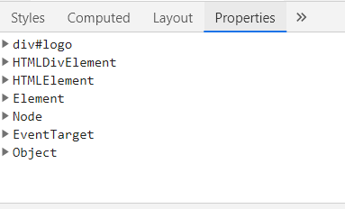

# 2021.02.06 TIL

## 문서 객체 모델 (Document Object Model; DOM)

---

### 0. 배경 및 목표

- 자바스크립트는 동적인 웹페이지를 구현하기 위해 만들어진 스크립트 언어입니다. 동적인 웹페이지를 구현하는 것은 문서의 구조나 스타일, 콘텐츠를 변경하는 것이며 이는 DOM 조작을 통해 가능합니다.
- 그렇다면 DOM은 무엇이고 DOM을 조작한다는 것은 어떤 의미인지, 그리고 DOM을 조작하는 대표적인 방법은 무엇인지 알아보도록 하겠습니다.


### 1. DOM이란?

- HTML, XML 문서의 **프로그래밍 인터페이스**(API)로, 문서의 객체를 나타내고 상호작용할 수 있게 합니다.
- DOM은 문서의 내용과 구조를 노드 트리로 표현하고, 스크립트 언어는 DOM을 통해 문서의 구조, 스타일, 콘텐츠 등을 변경할 수 있습니다.
- 브라우저의 맥락에서 자바스크립트를 이루는 것은 핵심 언어인 [ECMA스크립트](https://www.ecma-international.org/publications-and-standards/standards/ecma-262/)와 [Web API](https://developer.mozilla.org/ko/docs/Web/API)이며,
  DOM은 대표적인 Web API입니다.


### 2. DOM 인터페이스

- DOM은 HTML/XML 문서를 다룰 수 있도록 [DOM 인터페이스](https://www.w3.org/TR/2004/REC-DOM-Level-3-Core-20040407/DOM3-Core.html#introduction-ID-E7C30826)를 명시하고 있습니다.

- DOM 인터페이스는 일종의 추상화된 기본 클래스로, 각각의 속성(Attributes)과 메서드를 가지고 있습니다.

- 대표적으로 [EventTarget](https://developer.mozilla.org/ko/docs/Web/API/EventTarget), [Node](https://developer.mozilla.org/ko/docs/Web/API/Node), [HTMLElement](https://developer.mozilla.org/ko/docs/Web/API/HTMLElement) 등이 있습니다.

- DOM의 객체들은 인터페이스를 상속받아 구현하며, addEventListener, appendChild 등 DOM 조작을 위해 사용하는 메서드들은 해당 객체가 상속받은 DOM 인터페이스의 메서드를 사용하는 것이라고 할 수 있습니다.

- MDN 문서에서 특정 메서드를 검색하면, 메서드 앞에 인터페이스를 정의하는 것을 볼 수 있습니다.

  - ex: [Element.classList](https://developer.mozilla.org/ko/docs/Web/API/Element/classList)

- 아래 그림과 같이 계층적 구조를 가지고 있으며, 하위 인터페이스는 상위 인터페이스를 상속합니다.

  

- 개발자도구 - Elements - Properties 탭에서 해당 노드 객체가 상속받은 인터페이스와 각각의 속성 및 메서드를 확인할 수 있습니다.




### 3. DOM 조작

- DOM 조작은 문서의 요소들이 구현하고 있는 인터페이스의 속성과 메서드를 이용해 가능합니다.

- 아래는 대표적인 DOM 조작의 유형과 이에 사용되는 속성 및 메서드입니다.

- [TutorialPost](https://tutorialpost.apptilus.com/code/posts/js/w-dom/)의 자료를 참고하였습니다. 

  

#### 1) 요소 접근 및 선택

- `document` 객체는 DOM의 최상위 객체로서 DOM의 진입점 역할을 합니다.

- `document` 객체는 `Document` 인터페이스를 구현하고 있으며, 해당 인터페이스의 메서드를 통해 요소에 접근하고 선택할 수 있습니다.

- 또는 `Node` 인터페이스의 속성을 통해 요소 접근 및 선택이 가능합니다.

- 요소 접근 및 선택에는 다음과 같이 3가지 방식을 사용할 수 있습니다.

- **(1) get 메서드**

  ```js
  // getElementById: 해당 id 속성을 가진 요소를 반환합니다.
  const app = document.getElementById('app');
  // getElementByClassName: 해당 class 속성을 가진 요소를 NodeList 객체로 묶어 반환합니다.
  const searchResult = document.getElementByClassName('search-result');
  // getElementByTagName: 해당 tagName 속성을 가진 요소를 NodeList 객체로 묶어 반환합니다.
  const header = document.getElementByTagName('header');
  ```

- **(2) querySelector**

  ``` js
  // querySelector: CSS 선택자를 이용하여 일치하는 요소 중 첫번째 요소를 반환합니다.
  const headerLogo = document.querySelector('header.logo');
  const activeList = document.querySelector('.active');
  ```

- **(3) `Node` 인터페이스 속성**

  ``` js
  // Node 인터페이스의 메서드를 이용합니다.
  // 해당하는 노드가 없으면 null을 반환합니다.
  // text 및 comment 또한 노드이므로, 해당 속성을 통해 선택할 수 있으므로,
  // 요소만 선택하고자 할 때는 중간에 Element를 포함한 메서드를 사용합니다.
  
  Node.parentNode             // 현재 요소노드의 부모 노드
  Node.previousSibling        // 이전 형제 노드
  Node.previousElementSibling // 이전 형제 요소 노드
  Node.nextSibling            // 다음 형제 노드
  Node.nextElementSibling     // 다음 형제 요소 노드
  Node.firstChild             // 현재 요소의 첫번째 자식 노드
  Node.firstElementChild      // 현재 요소의 첫번째 자식 요소 노드
  Node.lastChild              // 현재 요소의 마지막 자식 노드
  Node.lastElementChild       // 현재 요소의 마지막 자식 요소 노드
  ```


#### 2) 콘텐츠 조회 및 수정하기

- 선택한 요소의 내용을 조회하는 방법은 대표적으로 `innerHTML`, `innerText` 두 가지 방법이 있습니다.

- 두 방법 모두 `Element`인터페이스의 속성입니다.

- `innerHTML`은 HTML 태그까지 반환하며, 문자열로 값을 할당할 수도 있습니다.

- `innerText`는 HTML요소를 제거한 순수한 문자열만을 반환합니다.

  ``` js
  const title = document.querySelector('#title');
  
  title.innerHTML // <h1>hello world</h1>
  title.innerText // "hello world"
  ```

- 같은 속성을 이용해 해당 요소의 콘텐츠를 수정할 수도 있습니다.

  ``` js
  title.innerHTML = '<h1>bye world</h1>';
  title.innerText = 'oops!';
  ```

- `Node` 인터페이스의 `textContent` 속성은 `innerText`보다 먼저 정의되어 사용되었으나, 현재 모던 브라우저에서는 동일하게 작동합니다.

- `Document` 인터페이스의 `createTextNode`를 통해 텍스트 노드를 생성하고 `appendChild`하는 방법도 있습니다.


#### 3) 새 요소 만들기

- `Document` 인터페이스의 `createElement` 메서드를 이용해 새 요소를 만들 수 있습니다.

- 인수(argument)로 만들고자 하는 태그의 이름을 문자열로 전달합니다.

- 새로 만들어진 요소는 다른 메서드를 사용해 DOM에 추가하기 전까지는 메모리에만 존재합니다.

  ``` js
  const title = document.createElement('h1');
  title.innerText = 'DOM Manupulation Practice';
  title // <h1>DOM Manupulation Practice</h1>
  ```

  

#### 4) 요소 추가 및 수정하기

- `Node` 인터페이스의 `appendChild()` 메서드를 이용해 선택된 요소에 자녀 노드를 추가할 수 있습니다.

- 부모 요소의 마지막 자녀 요소로 추가됩니다.

- 인수로 추가할 노드를 전달합니다.

  ``` js
  const header = document.querySelector('header');
  header.appendChild(title);
  
  header // <header><h1>DOM Manupulation</h1></header>
  ```

- `Node` 인터페이스의 `insertBefore()` 메서드를 이용해 선택된 요소에 자녀 노드를 추가할 수 있습니다.

  ``` js
  const logo = document.createElement('img');
  logo.src = 'https://someImageSource...';
  header.insertBefore(logo, title);
  console.log(header); // <header><h1>DOM Manupulation</h1></header>
  ```

- 위에서 본 것과 같이 `innerHTML`에 HTML 태그가 포함된 문자열을 할당하여 새로운 자녀 노드 트리를 생성할 수도 있습니다.

  ``` js
  const parent = document.querySelector('#app');
  parent.innerHTML = `
  	<header>
  		<h1>DOM manipulation</h1>
  	</header>
  `;
  ```

-  `ParentNode` 믹스인 인터페이스의 `append()` 메서드는 ` appendChild()`와 유사하게 사용할 수 있습니다.

  - 해당 믹스인의 속성과 메서드는 `Element` 인터페이스에 의해 구현됩니다.
  - 노드를 추가하거나 `DOMString`을 `text` 노드처럼 추가할 수 있습니다.
  - 여러 개의 노드를 한 번에 추가할 수 있습니다.

  ``` js
  const parent = document.createElement('div');
  const h1 = document.createElement('h1');
  const h2 = document.createElement('h2');
  
  parent.append('practice', h1, h2);
  
  console.log(parent.innerHTML); // "practice<h1></h1><h2></h2>"
  ```

- `ChildNode` 믹스인 인터페이스의 `replaceWith()` 메서드를 이용해 선택된 노드를 다른 노드로 대체할 수 있습니다.

  ``` js
  // 작성예정
  ```

- `Element` 인터페이스의 `outerHTML` 속성을 이용해 선택된 노드를 대체할 수도 있습니다.

  ``` js
  // 작성예정
  ```


### 5. 정리

- DOM은 HTML 문서에 접근하고 조작하기 위한 API
- DOM의 객체들은 DOM 인터페이스를 상속해 구현
- DOM 인터페이스의 속성 및 메서드를 사용해 DOM에 접근 및 조작 가능


### 6. 연관된 내용

- [HTML 요소의 `property`와 `attribute`의 차이점](210208_박태웅_HTML_Property와_Attribute_차이점.md)


---

### 참고자료

- [MDN - DOM 소개](https://developer.mozilla.org/ko/docs/Web/API/Document_Object_Model/%EC%86%8C%EA%B0%9C)
- [W3C - DOM Level2 Core](https://www.w3.org/TR/DOM-Level-2-Core/core.html)
- [TuturialPost - JavaScript 웹개발과 DOM](https://tutorialpost.apptilus.com/code/posts/js/w02-script-tag/)